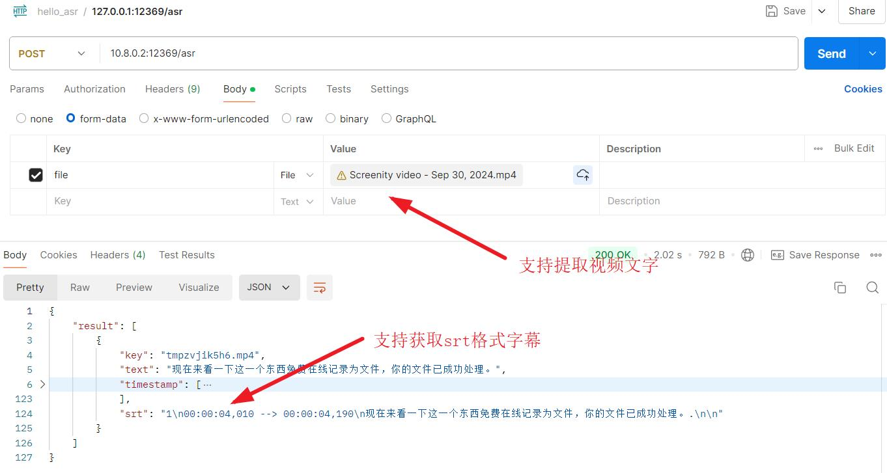

# 语音转文字ASR工具

基于funasr开源项目和模型，快速搭建语音转文字的api服务

## 安装

### 方式一：本地python环境启动

安装所需软件包

``` 
pip install -i https://mirror.baidu.com/pypi/simple -r requirements.txt
```

启动

``` 
python main.py
```

### 方式二：docker-compose一键安装

```
docker-compose up -d
```

## 相关接口

提供的接口：`POST` http://127.0.0.1:12369/asr
- 支持mp3、wav音频文件转文字

- 支持mp4等视频文件转文字
