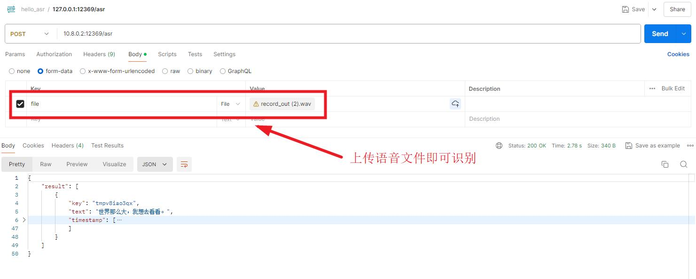

# 文件转markdown

快捷搭建文件转markdown的api服务

## 安装

### 方式一：本地python环境启动

注意：在安装python包之前需要安装libreoffice+pandoc环境，这里省略了...

安装所需软件包

``` 
pip install -i https://mirror.baidu.com/pypi/simple -r requirements.txt
```

启动

``` 
python main.py
```

### 方式二：docker-compose一键安装

```
docker-compose up -d
```

## 相关接口

提供的接口：`POST` http://127.0.0.1:6677/convert

